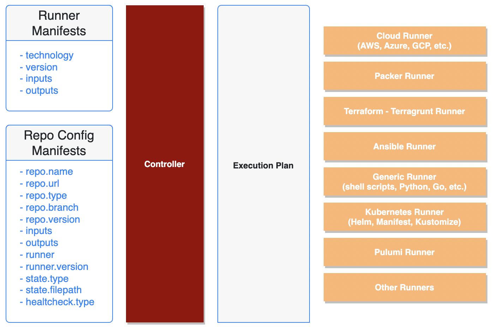

# Klopac

 [](https://GitHub.com/kloia/klopac/releases/) [](https://lbesson.mit-license.org/) [](https://slack.crossplane.io) [](https://twitter.com/intent/follow?screen_name=crossplane_io&user_id=788180534543339520)


Klopac is a tool that let's you easily provision your infrastructure and applications. Cloud or on-premise it can schedule its runners anywhere so its extendable and scalable. Making job easier with default configurations but also lets users fine tune with YAML formatted configuration files.

## Releases

Current and upcoming releases listed below.

| Release | Release Date |
|:---:|:---:|
| 0.1-alpha | 01.05.2022 |
| 1.0 | 01.12.2022 (upcoming) |

## How it works

Klopac adopts a layered arhitecture for seperation of concerns. Each layer corresponds to a diffent Klopac component (provisioning, validation, execution and finalizing).


It covers different layers of infrastructure needs such as image, instances, integrations, gitops and applications.


After provision and validation steps an execution plan is generated for your configuration code and klopac controller make necessary executions via klopac runners. Klopac supports a various techonologies for different execution types (Ansible, terraform, pulumi etc.).



### Klopac Runner List

- Ansible	(5.2.0)
- Docker	(20.10.12)
- Kubectl	(1.23.3)
- Packer    (1.7.9)
- Terraform	(1.1.4)
- Terragrunt	(0.36.0)
- Pulumi	(3.22.1)

## Getting Started

You can use docker image like this

```
docker run --rm -ti -v /var/run/docker.sock:/var/run/docker.sock -v $PWD:/data  kloiadocker/klopac-runner:0.1-alpha ansible-playbook /data/example.yaml
```

## Get Involved

Klopac repository licensed under MIT. Such contributions are always welcome. To fill a bug, suggest an improvement or request a new feature open an issue against Klopac repository. 

Refer to our contribution guideline for more information about how you can get involved.

## License

This repository (Klopac) licensed under MIT.

