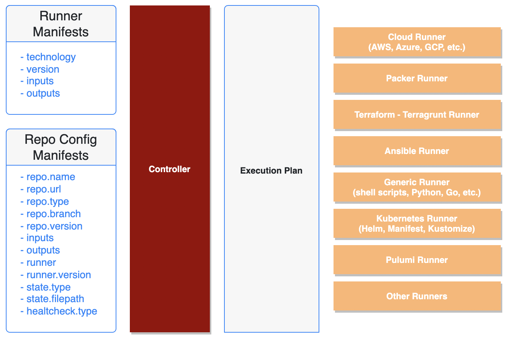

# KloPaC Runners

### **KloPaC** uses runners during the execution plan

>### Runners 

* [KloPaC](../../docker/runner/klopac/Dockerfile): KloPaC layer's base docker image
* [Ansible](../../docker/runner/ansible/Dockerfile): for Ansible based repo's docker image
* [Cloud](../../docker/runner/cloud/Dockerfile): for Cloud provider (AWS, Azure, GCP, etc.) based repo's docker image
* [Generic](../../docker/runner/generic/Dockerfile): for Generic (Bash Script, Python, Go, etc.) repo's docker image
* [Kubernetes](../../docker/runner/kubernetes/Dockerfile): for Kubernetes (Helm, Manifests, Kustomize) based repo's docker image
* [Packer](../../docker/runner/packer/Dockerfile): for Packer based repo's docker image
* [Pulumi](../../docker/runner/pulumi/Dockerfile): for Pulumi based repo's docker image
* [Terraform](../../docker/runner/terraform/Dockerfile): for Terraform based repo's docker image
* [Terraform AWS](../../docker/runner/terraform-aws/Dockerfile): for Terraform and AWS based repo's docker image
* [OnPrem](../../docker/runner/onprem/Dockerfile): for OnPrem (vSphere, etc.) repo's docker image
  
> All runners are defined in **version-based yaml files**.

> All runner domain structures are defined under the **runner object**.

> Multiple technology-based runners are described with custom versioning.