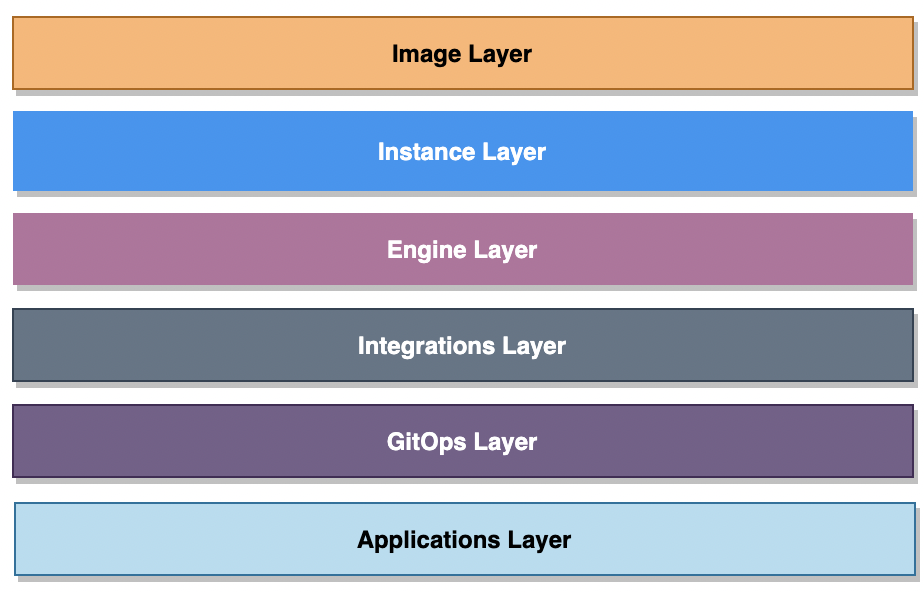

# KloPaC Variables

### **KloPaC variables** are divided into two-level architecture

 

 

### Layered variables

* [general.yaml](./general.yaml) : General platform-specific variables.
* [image.yaml](./image.yaml):  Image creation tools specific variables.
* [instance.yaml](./instance.yaml): Instance creation tools specific variables.
* [engine.yaml](./engine.yaml): Kubernetes engine specific variables.
* [integration.yaml](./integration.yaml): Kubernetes engine integrations specific variables.
* [gitops.yaml](./gitops.yaml): GitOps tools specific variables.
* [applications.yaml](./applications.yaml): Application layer-specific variables.

### Default variables

Under the [defaults directory](./defaults)  contains yaml files for layered architecture tools variables (like version). These variables are used for selecting repo manifest files.
 

> All variable files used the **yaml** format.

> All variable definitions are used as **class names**.

> All the time used **three-digit** class names (not file names).

>Layered variables are **linked to default variables** with class names.
